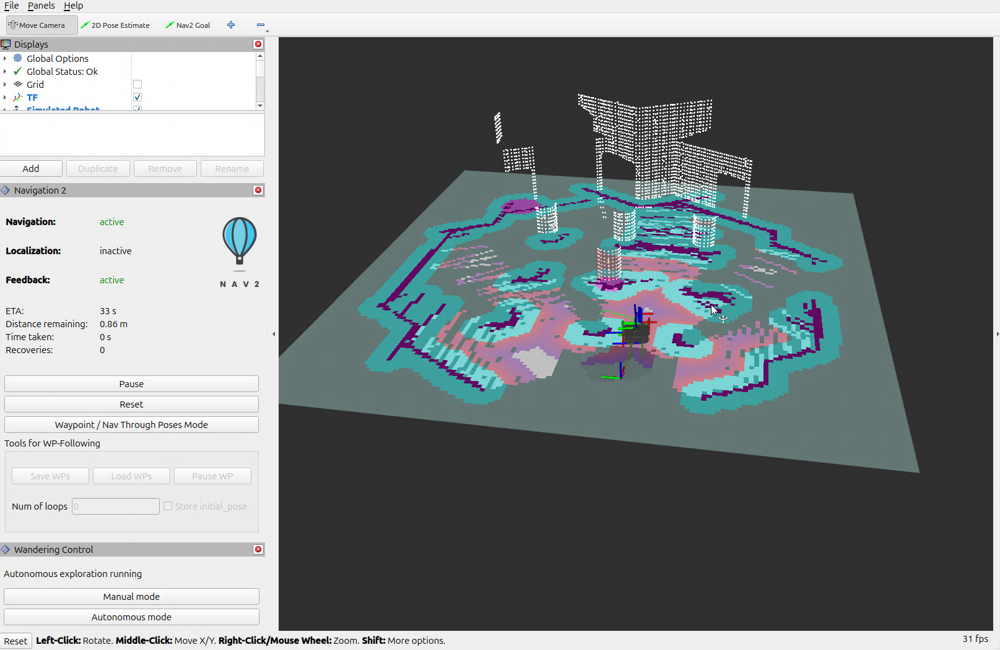

# Simulating `wandering`

In this software reference, you'll simulate the `wandering` pipeline. This pipeline is built of multiple components available in the Robotics AI Suite, showcasing how to simulate a complex perception and navigation workload in Gazebo.

`wandering` is a fully-autonomous robotics pipeline, allowing a robot to map the space around it and actually navigate to make sure its map is complete, all without human intervention. You can consider it as a demonstration of what combining multiple ingredients from Intel Robotics AI Suite can create out of the box, and give you an idea of how you can use them in your own robotics use-case.

## Architecture

Wandering combines sensor input, SLAM and mapping, navigation, and robot control.
It continuously updates an occupancy map, chooses unexplored frontiers, and
sends navigation goals through Nav2 while avoiding obstacles identified by the
perception pipeline.

```{mermaid}
flowchart TD
    subgraph Sim["Gazebo Simulation"]
        Waffle["TurtleBot3 Waffle RGB-D Model"]
        Bridge["ros_gz_bridge\n(Generic RGB-D & Base Bridge)"]
        Waffle --> Bridge
    end

    subgraph Perception["Perception & SLAM"]
        Bridge -->|"/scan"| SLAM["SLAM / RTAB-Map\n(Mapping & Localization)"]
        Bridge -->|"/camera/depth/color/points"| Fusion["adbscan_sensor_fusion\n(Ground Removal & Voxel Downsampling)"]
        Fusion -->|"/adbscan/points"| ADBSCAN["ADBSCAN Node\n(3D Clustering)"]
    end

    subgraph Nav["Nav2 Navigation Stack"]
        ADBSCAN -->|"/obstacle_array"| Costmaps["Costmaps\n(ADBScanLayer + Obstacle Layers)"]
        Bridge -->|"/scan"| Costmaps
        SLAM -->|"/map & TF"| Nav2["Nav2 Planner & Controller\n(NavigateToPose Action Server)"]
        Costmaps --> Nav2
    end

    subgraph App["Wandering Application"]
        Costmaps -->|"/global_costmap/costmap"| Mapper["wandering_app\n(Frontier Exploration)"]
        Mapper -->|"NavigateToPose Goal"| Nav2
    end

    Nav2 -->|"/cmd_vel"| Bridge
    Bridge --> Waffle
```

## Components

- `adbscan_sensor_fusion` time-synchronizes and filters 2D LiDAR and 3D depth-camera point clouds.
- `adbscan_ros2` identifies and clusters 3D obstacle objects from the fused point cloud.
- `nav2_adbscan_layer` marks object-sized ADBSCAN obstacle clusters into Nav2 local and global costmaps.
- RTAB-Map (or SLAM Toolbox) creates and updates the environment map and robot localization.
- Nav2 plans and executes movement toward exploration goals using enhanced costmaps.
- `wandering_app` (`WanderingMapper` and `GoalCatcher`) selects unvisited frontiers and dispatches `NavigateToPose` goals.

## Source Code

The [Wandering source code](https://github.com/open-edge-platform/edge-ai-suites/tree/main/robotics-ai-suite/components/wandering)
is available with the Robotics AI Suite.

## Run the Gazebo Simulation

This tutorial shows a TurtleBot3 Waffle robot performing autonomous mapping of
the TurtleBot3 robot world in Gazebo simulation using a composed RGB-D sensor payload.
For more information about TurtleBot3 Waffle robot, refer to
[TurtleBot3 documentation](https://emanual.robotis.com/docs/en/platform/turtlebot3/simulation/#gazebo-simulation).

### Prerequisites

Complete the [Getting Started](../../../platform_foundation/getting_started.md) guide before continuing.

### Run the Sample Application

1. If your system has an Intel® GPU, follow the steps in the
   [Getting Started](../../../platform_foundation/getting_started.md) guide to enable the GPU for
   simulation. This step improves Gazebo simulation performance.

2. Install the `wandering` metapackage:

   <!--hide_directive::::{tab-set}hide_directive-->
   <!--hide_directive:::{tab-item}hide_directive--> **Jazzy**
   <!--hide_directive:sync: jazzyhide_directive-->

   ```bash
   sudo apt update
   sudo apt install ros-jazzy-wandering
   ```

   <!--hide_directive:::hide_directive-->
   <!--hide_directive:::{tab-item}hide_directive--> **Humble**
   <!--hide_directive:sync: humblehide_directive-->

   ```bash
   sudo apt update
   sudo apt install ros-humble-wandering
   ```

   <!--hide_directive:::hide_directive-->
   <!--hide_directive::::hide_directive-->

3. Execute the launch command below to start the simulation:

   ```bash
   ros2 launch wandering_bringup wandering_sim.launch.py gui:=true
   ```

   **Expected output:**

   Gazebo client, RViz2, and the `wandering` nodes start, and the robot
   begins exploring and mapping inside the simulation. See the simulation
   snapshot:

   

   RViz2 shows the mapped area and the position of the robot:

   

   **Simulation options:**

   - **Select SLAM backend:** To switch from visual RGB-D SLAM (RTAB-Map) to 2D LiDAR SLAM (SLAM Toolbox), add `slam_backend:=slam_toolbox`:

     ```bash
     ros2 launch wandering_bringup wandering_sim.launch.py slam_backend:=slam_toolbox gui:=true
     ```

   - **Headless mode:** To run without opening the Gazebo GUI, set `gui:=false`:

     ```bash
     ros2 launch wandering_bringup wandering_sim.launch.py gui:=false
     ```

4. To conclude, use ``Ctrl-c`` in the terminal where you are executing
   the command.

### Troubleshooting

For general robot issues, refer to
the [troubleshooting guide](../../../resources/troubleshooting).

## Next Steps

You've completed the simulation-focused software references. Continue to the
[deployment learning path](../deployment/index.md) to run the
Wandering workflow on a physical robot.